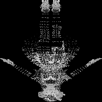

# objtoimage

### Converting OBJ Vertices to 2D Images

3D modeling and visualization are essential components of various industries, including gaming, film, and architecture. Often, 3D objects are stored in files with the `.obj` format, a standard for representing 3D geometry. However, there are scenarios where you might need to process or analyze these models in a 2D context. This is where our Python script comes into play, converting 3D vertex data from `.obj` files into 2D images. Here's an in-depth look at how this script works and its potential applications.

#### What is an OBJ File?
An OBJ file is a standard 3D image format that contains 3D coordinates (vertices), texture maps, and other model information. It's widely used due to its simplicity and compatibility with various 3D graphics applications. Vertices are the key components we're interested in, as they represent the corners or points of the 3D object.

#### The Python Script Breakdown
Our script is designed to read, process, and convert these vertices into a 2D representation. Here's how it works step by step:

1. **Setting Up the Environment**:
    - We use `cv2` (OpenCV) for image processing and `numpy` for handling arrays efficiently.

2. **Loading Vertices (`load_vertices`)**:
    - This function reads the `.obj` file, extracting the vertex data (lines starting with 'v'). It converts these coordinates from strings to floating points and stores them in an array.

3. **Normalizing Vertices (`normalize_vertices`)**:
    - To ensure our vertices fit within a standard range (0 to 1), we normalize them. This step is crucial for consistency and effectiveness when encoding the data into an image.

4. **Encoding Vertices to Image (`encode_vertices_to_image`)**:
    - We then map these normalized vertices to a 2D plane, creating an image. The x and y coordinates determine the pixel's position, while the z coordinate (depth) determines its color intensity. This results in a grayscale image representing the 3D object.

5. **Execution and Output**:
    - The script is initially set to process an 'idol.obj' file, but you can modify this to any `.obj` file you wish to analyze. After processing, it outputs the range of original vertex values and saves the encoded image as 'encoded_vertices.png'.

#### Applications and Considerations
- **Visualization**: Quickly visualize the depth and structure of 3D models in a 2D format.
- **Machine Learning**: Use the 2D images for training machine learning models, especially in scenarios where 3D data might be too complex or resource-intensive to work with directly.
- **Analysis**: Perform various analyses on the 2D representation, like pattern recognition or structural analysis.

**However, consider the following**:
- The script assumes that the `.obj` file primarily contains vertex data.
- The simplicity of the encoding might not capture very complex structures accurately.
- You might need to adjust the resolution or encoding method depending on your specific needs.

#### Wrapping Up
This script bridges the gap between 3D and 2D data representations, opening up a range of possibilities for analysis, machine learning, and more. Whether you're a game developer looking to analyze 3D models or a researcher interested in pattern recognition in spatial data, this tool provides a foundational step towards understanding and leveraging the world of 3D geometry in a 2D context. As always, consider your specific needs and adjust the script accordingly to get the most out of your 3D data!
